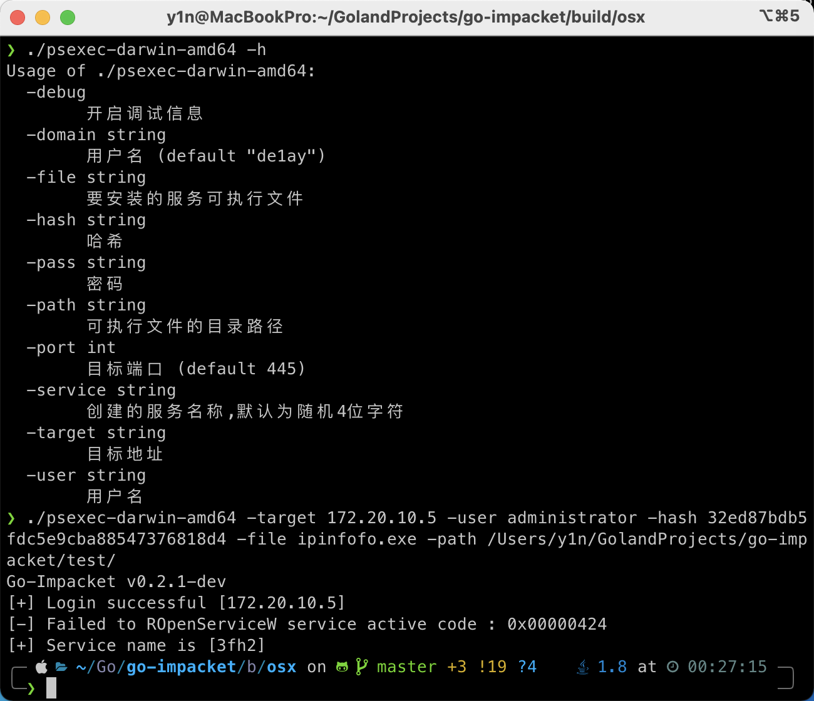
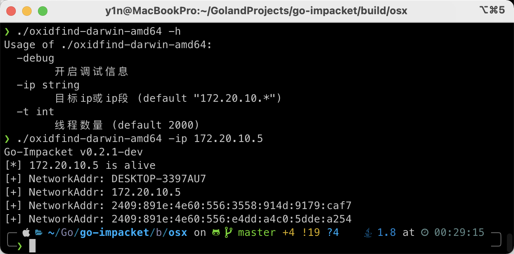

Go-Impacket
===
-------
基于golang实现的impacket  
> 目前仅实现smb2、dce/rpc协议
-------
示例
-------
```shell
psexec -target 172.20.10.5 -user administrator -pass 123456 -file testt.exe -path ./test/ -service testzz
psexec -target 172.20.10.5 -user administrator -hash 32ed87bdb5fdc5e9cba88547376818d4 -file testt.exe -path ./test/ -service testzz
oxidfind -ip 172.20.10.*
```
效果图
-------
psexec  

oxidfind

-------
参考
-------
参考以下代码  
**smb**: https://github.com/stacktitan/smb